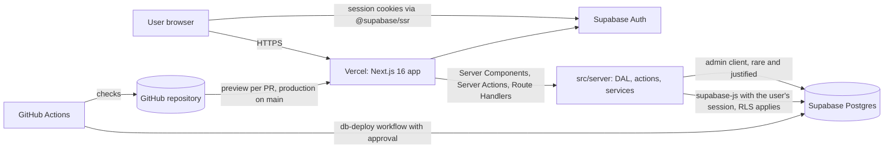

# Architecture overview

Owner: solution-architect. Living document: update it when an ADR changes the baseline.

## System context

## Layers

| Layer | Location | Responsibility | May import |
|---|---|---|---|
| Routes and UI | `src/app`, `src/components` | Rendering, interaction, composition | `src/components`, `src/lib` (client-safe), Server Actions, DAL (Server Components only) |
| Server Actions | `src/server/actions` | Validate, authorize, execute, revalidate | services, DAL, validation |
| Data access layer | `src/server/dal` | Authorized reads and writes returning DTOs | Supabase server client, auth helpers |
| Services | `src/server/services` | Business rules, integrations; framework-free where practical | DAL, external SDKs |
| Auth helpers | `src/server/auth` | Current user from verified claims, permission checks | Supabase server client |
| Supabase clients | `src/lib/supabase` | SSR clients for server, browser and proxy | `@supabase/ssr` |
| Proxy | `src/proxy.ts` | Session refresh, optimistic redirects, security headers and CSP nonce | Supabase proxy helper |
| Database | `supabase/migrations` | Schema, RLS, constraints, indexes | |

## Key decisions

| ADR | Decision |
|---|---|
| [0001](adr/0001-record-architecture-decisions.md) | Record architecture decisions as ADRs |
| [0002](adr/0002-stack-nextjs-supabase-vercel.md) | Next.js 16 + Supabase + Vercel as the baseline stack |
| [0003](adr/0003-sql-migrations-as-source-of-truth.md) | Hand-written SQL migrations as the schema source of truth, with generated portability artifacts |
| [0004](adr/0004-authorization-defense-in-depth.md) | Authorization in the DAL and in Postgres RLS |
| [0005](adr/0005-spec-first-agent-team.md) | Spec-first delivery by a Claude Code agent team with enforced delegation |

## Cross-cutting concerns

- **Security:** `docs/security/security-baseline.md`.
- **Performance budgets and other NFRs:** `specs/product/nfr.md`.
- **Portability:** `db/PORTABILITY.md` and the generated `db/portability/supabase-dependencies.md`.
- **Operations:** `docs/runbooks/`.
