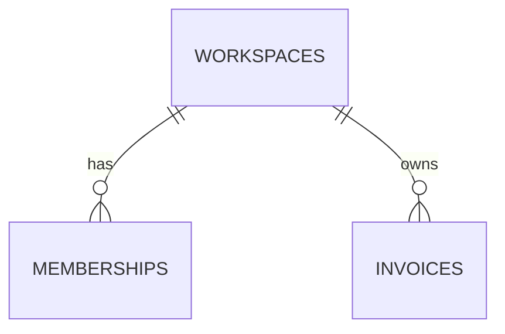

# Data model: Export invoices as CSV

> Reference example showing the RLS matrix and portability notes.

## 1. Entities and relationships

## 2. Tables
No new tables. Existing `public.invoices` (from the invoices spec) is read.

## 3. Indexes
| Index | Columns | Serves query |
|---|---|---|
| `invoices_workspace_issue_date_idx` | `(workspace_id, issue_date)` | export by workspace and date range; RLS predicate on workspace_id |

## 4. Row level security matrix
| Table | Role | select | insert | update | delete | Predicate |
|---|---|---|---|---|---|---|
| `invoices` | anon | no | no | no | no | |
| `invoices` | authenticated | member | owner | owner (with check) | owner | `private.is_member(workspace_id)` / `private.is_owner(workspace_id)` |

The export is additionally restricted to owners in the DAL (defense in depth, AC-003).

## 5. Functions and triggers
Unchanged (`private.is_member`, `private.is_owner`: `security definer`, `set search_path = ''`).

## 6. Migration plan
1. `20260113101500_invoices_export_index.sql`: `create index concurrently` is not allowed inside a transaction in Supabase migrations; the table is small in all environments, so a regular `create index if not exists` is used.

## 7. Seed data
Two workspaces, one owner and one member each, 30 invoices across two months.

## 8. Retention and deletion
No change.

## 9. pgTAP tests
| Test file | Covers |
|---|---|
| `supabase/tests/database/invoices_rls.test.sql` | member of W1 cannot select W2 invoices; anon selects nothing |

## 10. Portability notes
| Construct | Why | Portable alternative |
|---|---|---|
| `private.is_member()` uses `auth.uid()` | RLS membership check | application-level check in the DAL already exists; on another Postgres, replace `auth.uid()` with `current_setting('app.user_id')::uuid` set per transaction |
