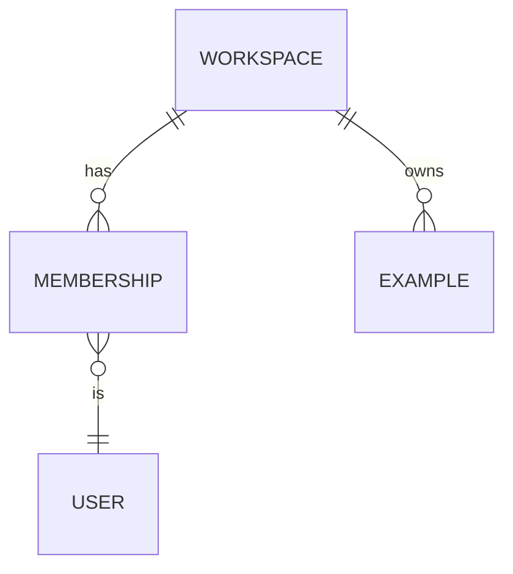

<!-- harness:template -->
<!-- Author: database-architect. Remove the marker when complete. Write "Not applicable: no persisted data changes" if nothing changes. -->

# Data model: {{title}}

## 1. Entities and relationships

## 2. Tables
### `public.example`
| Column | Type | Null | Default | Constraints | Notes |
|---|---|---|---|---|---|
| `id` | `uuid` | no | `gen_random_uuid()` | PK | |
| `workspace_id` | `uuid` | no | | FK `workspaces(id)` on delete cascade | indexed |
| `created_at` | `timestamptz` | no | `now()` | | |
| `updated_at` | `timestamptz` | no | `now()` | | trigger `private.set_updated_at()` |

## 3. Indexes
| Index | Columns | Serves query |
|---|---|---|
| `example_workspace_id_idx` | `workspace_id` | list by workspace, RLS predicate |

## 4. Row level security matrix
| Table | Role | select | insert | update | delete | Predicate |
|---|---|---|---|---|---|---|
| `example` | anon | no | no | no | no | |
| `example` | authenticated | member | member | member (with check) | owner | `private.is_member(workspace_id)` |

## 5. Functions and triggers
| Name | Schema | Security | Purpose |
|---|---|---|---|
| `set_updated_at()` | `private` | invoker | maintain `updated_at` |

## 6. Migration plan
<!-- Ordered migrations with names, expected lock impact, backfills, data migration steps, and whether any statement is destructive (needs the harness:allow-destructive marker and a backup plan). -->
1. `YYYYMMDDHHMMSS_create_example.sql`

## 7. Seed data
<!-- Fake, idempotent rows for local development and tests. -->

## 8. Retention and deletion
<!-- How long data lives, deletion on account removal, GDPR export. -->

## 9. pgTAP tests
| Test file | Covers |
|---|---|
| `supabase/tests/database/example.test.sql` | RLS per role, constraints |

## 10. Portability notes
<!-- Supabase-specific constructs introduced (auth.users FK, auth.uid(), storage, realtime, extensions, security definer helpers) and the portable alternative for each. The generated inventory db/portability/supabase-dependencies.md must match. -->
| Construct | Why | Portable alternative |
|---|---|---|
