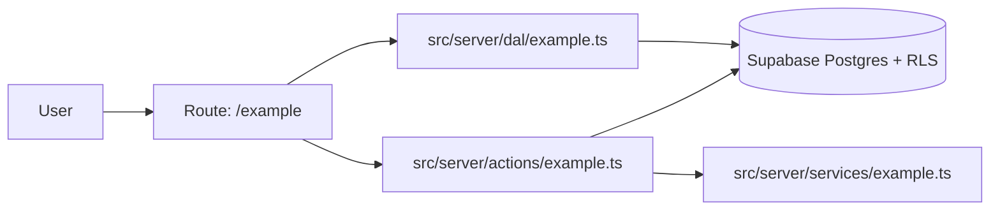
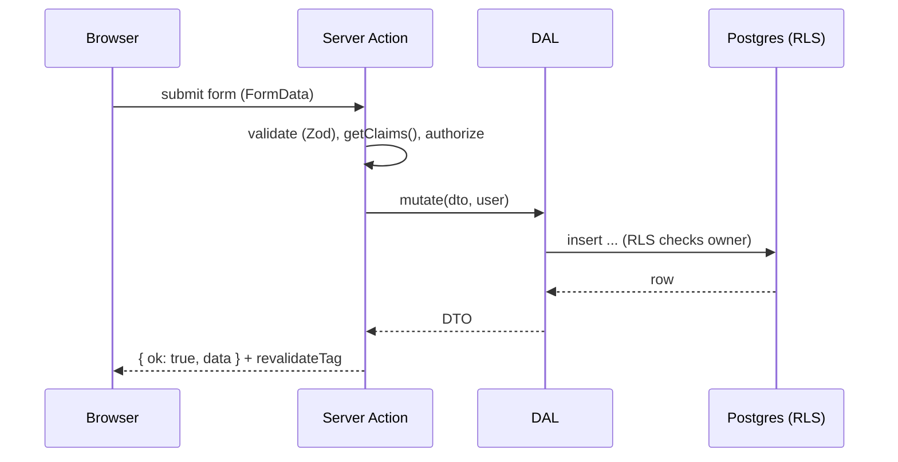

<!-- harness:template -->
<!-- Author: solution-architect. Remove the marker when complete. Reference data-model.md, ui.md and api.md instead of duplicating them. Keep the design implementable in parallel by the specialists. -->

# Design: {{title}}

## 1. Context
<!-- Link spec.md sections and ACs. Current state of the relevant code. Constraints from NFRs. -->

## 2. Overview
<!-- One paragraph plus a diagram. -->

## 3. Components and responsibilities
| Component | Path | Owner | Responsibility |
|---|---|---|---|
| Route | `src/app/...` | frontend-engineer | |
| DAL | `src/server/dal/...` | backend-engineer | |
| Action | `src/server/actions/...` | backend-engineer | |
| Primitives | `src/components/ui/...` | ux-ui-designer | |
| Tables and policies | `supabase/migrations/...` | database-architect | |

## 4. Data flow
<!-- Sequence for each main flow, including authorization checks and revalidation. -->

## 5. Rendering and caching
| Route | Rendering | Data | Cache and revalidation |
|---|---|---|---|
| `/example` | Server Component, streamed | DAL | per-user, not cached / `"use cache"` + `cacheTag('x')` |

## 6. API contracts
<!-- Summary only; details in api.md. -->

## 7. Data model
<!-- Summary only; details in data-model.md. -->

## 8. Authentication and authorization
<!-- Who can do what. TypeScript checks in DAL/actions and matching RLS policies (defense in depth). -->

## 9. Error handling
<!-- Expected errors, user-facing messages, typed results, logging. -->

## 10. Security and privacy
<!-- STRIDE-lite notes for this change, personal data handling, abuse cases, rate limits. -->

## 11. Performance
<!-- Budgets from NFRs, query plans for new queries, bundle impact of new client code. -->

## 12. Observability
<!-- Logs (no personal data), metrics, analytics events, alerts. -->

## 13. Rollout and migration
<!-- Feature flag, migration ordering, backfills, backwards compatibility, rollback. -->

## 14. Portability impact
<!-- New Supabase-specific or Vercel-specific dependencies and how they could be replaced. -->

## 15. Alternatives considered
| Option | Pros | Cons | Decision |
|---|---|---|---|

## 16. Traceability
| AC / FR | Components | Tasks |
|---|---|---|
| AC-001 | | T-001 |

## 17. ADRs
- none, or `docs/architecture/adr/NNNN-...`
