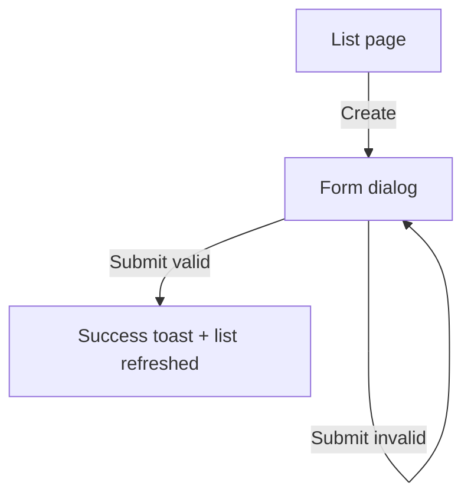

<!-- harness:template -->
<!-- Author: ux-ui-designer. Remove the marker when complete. Write "Not applicable: no user interface" for backend-only work. -->

# UI: {{title}}

## 1. Screens and routes
| Screen | Route | Access | Entry points |
|---|---|---|---|
| | `/...` | signed-in members | |

## 2. Flows

## 3. Layout per breakpoint
| Breakpoint | Layout |
|---|---|
| mobile (< 640px) | |
| tablet (640 to 1024px) | |
| desktop (> 1024px) | |

## 4. Components
| Component | Status | Location | Notes |
|---|---|---|---|
| Button | existing | `src/components/ui/button.tsx` | |
| ExampleTable | new feature component | `src/components/example/` | frontend-engineer |

## 5. States
| State | What the user sees |
|---|---|
| Loading | skeleton rows |
| Empty | illustration-free message + primary action |
| Error | inline message with retry, no technical details |
| Permission denied | explanation + way back |
| Success | confirmation (toast or inline) |

## 6. Interactions and validation
| Element | Behavior | Validation message |
|---|---|---|

## 7. Copy
<!-- Final texts for titles, buttons, empty states, errors and confirmations. -->

## 8. Accessibility
- Keyboard path:
- Focus management (dialogs, after submit):
- Labels and descriptions:
- Contrast and non-color cues:
- Reduced motion:

## 9. Tokens and visual notes
<!-- Tokens used or added in globals.css; icons; imagery; motion. -->

## 10. Acceptance mapping
| AC | Screen / state |
|---|---|
